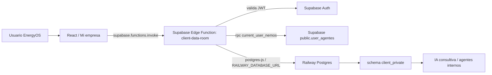

# EnergyOS - Data Room privado para IA

Fecha de referencia: 2026-05-17

Este documento resume la implementacion del modulo `Mi empresa` y del nuevo Data Room privado de EnergyOS. El objetivo es dar contexto tecnico al equipo que construye la IA que va a consumir estos datos para generar analisis, recomendaciones, alertas y evidencia consultiva.

## 1. Objetivo funcional

Se incorporo una capa estructurada para capturar informacion privada del cliente que antes no existia como datos normalizados dentro del sistema.

La necesidad original era que EnergyOS pudiera reunir, ordenar y validar datos como:

- Contratos MATER, PPA y distribuidora.
- Precios pactados, formulas, vencimientos, clausulas y energia contratada.
- Facturas, DTE y liquidaciones CAMMESA.
- Sitios, puntos de suministro, potencia contratada y maxima demandada.
- Presupuesto, forecast y provisiones.
- Reclamos abiertos y estado.
- Documentacion SMEC, auditorias y observaciones.
- Responsables internos y fechas limite.
- Documentos PDF, Excel y contratos como evidencia.

La decision estrategica fue no depender solamente de documentos cargados por usuarios, porque cada documento puede venir en formatos distintos. Los documentos pasan a ser evidencia vinculada, pero la IA debe apoyarse primero en campos estructurados y normalizados.

## 2. Principio de arquitectura

Supabase se mantiene como capa de identidad, login y autorizacion.

Railway Postgres pasa a guardar la informacion privada operativa del cliente.

El frontend nunca debe conectarse directamente a Railway. Toda lectura o escritura debe pasar por una API backend que valide:

1. JWT del usuario en Supabase.
2. NEMOs autorizados del usuario.
3. Que el NEMO solicitado coincida con los permisos del usuario.
4. Reglas minimas de integridad del payload.

Arquitectura implementada:



## 3. Modulos y archivos agregados

### Frontend

- `src/pages/app/MiEmpresa.tsx`
  - Nueva pantalla `/app/empresa`.
  - Muestra resumen de informacion privada cargada y faltante.
  - Lista contratos cargados.
  - Permite abrir formulario especializado para contrato MATER.
  - Permite crear y editar contratos.
  - Guarda contra la API `client-data-room`.

- `src/types/dataRoom.ts`
  - Define tipos compartidos del Data Room.
  - Define monedas, estados, tipos de contrato, tipos de precio, tecnologias, contrato draft, contrato guardado, readiness y completitud.

- `src/services/dataRoom.validation.ts`
  - Validaciones puras del formulario MATER.
  - Calculo de completitud general del Data Room.
  - Calculo de readiness por seccion del contrato.

- `src/services/dataRoom.validation.test.ts`
  - Tests de reglas de validacion y completitud.

- `src/services/dataRoom.ts`
  - Cliente frontend para invocar la Edge Function `client-data-room`.
  - Expone `fetchDataRoom()` y `saveMaterContract()`.

- `src/App.tsx`
  - Nueva ruta: `/app/empresa`.

- `src/components/layout/AppShell.tsx`
  - Nueva entrada de navegacion: `Mi empresa`.

### Backend/API

- `supabase/functions/client-data-room/index.ts`
  - Nueva Supabase Edge Function.
  - Valida JWT de Supabase.
  - Resuelve NEMOs autorizados con `current_user_nemos`.
  - Lee y escribe en Railway usando `RAILWAY_DATABASE_URL`.
  - Expone GET y POST para contratos del Data Room.

### Base de datos Railway

- `scripts/sql/railway_client_private_data_room.sql`
  - Crea `schema client_private`.
  - Crea 15 tablas privadas.
  - Crea indices principales.
  - Crea vista `client_private.v_contracts_latest`.

- `scripts/apply_railway_client_private_data_room.py`
  - Script repetible para aplicar el SQL contra Railway usando variables de entorno:
    - `RAILWAY_DATABASE_URL`
    - `DATABASE_PUBLIC_URL`
    - `DATABASE_URL`

### Documentacion estrategica

- `docs/plans/2026-05-17-data-room-cliente-design.md`
  - Explica decision producto/datos: documentos como evidencia, campos estructurados como fuente primaria.

- `docs/plans/2026-05-17-data-room-cliente.md`
  - Plan de implementacion actualizado con Railway y API.

## 4. Flujo funcional en la app

Ruta de usuario:

1. Usuario entra a EnergyOS.
2. Supabase autentica la sesion.
3. AppContext resuelve el agente/NEMO asociado.
4. Usuario abre `Mi empresa`.
5. La pantalla llama a `fetchDataRoom({ nemo })`.
6. Frontend invoca `client-data-room` por Supabase Functions.
7. Edge Function valida JWT y NEMO autorizado.
8. Edge Function consulta `client_private.v_contracts_latest` en Railway.
9. Frontend muestra lista de contratos cargados y resumen de campos faltantes.
10. Usuario toca `Cargar informacion`, `Agregar contrato` o `Cargar contrato MATER`.
11. Se abre el formulario MATER.
12. Usuario completa datos estructurados.
13. Frontend calcula readiness y errores.
14. Usuario guarda.
15. `saveMaterContract()` invoca `client-data-room` por POST.
16. Edge Function valida payload y permisos.
17. Railway crea o actualiza `client_private.contracts`.
18. Railway crea una nueva version en `client_private.contract_versions`.
19. `current_version_id` queda apuntando a la version vigente.
20. Frontend refresca la lista local con el contrato guardado.

## 5. Modelo de autorizacion

La funcion `client-data-room` no confia en el NEMO enviado por el frontend.

Validaciones:

- Requiere header `Authorization: Bearer <jwt>`.
- Llama a `supabase.auth.getUser(token)`.
- Llama a RPC `current_user_nemos`.
- Normaliza NEMOs a uppercase y 8 caracteres.
- Si el usuario tiene varios NEMOs, exige parametro `nemo`.
- Si el NEMO solicitado no esta autorizado, responde 403.

RPC utilizada:

```sql
public.current_user_nemos()
```

Funcion actual:

```sql
select ua.nemo
from public.user_agentes ua
where ua.user_id = auth.uid();
```

Regla importante para la IA y para futuros endpoints:

Nunca consultar datos privados solo por `user_id`. La particion funcional es por `nemo` autorizado.

## 6. API implementada: client-data-room

Endpoint base:

```text
https://<supabase-project>.supabase.co/functions/v1/client-data-room
```

### GET

Obtiene contratos vigentes/latest para un NEMO autorizado.

Query:

```text
GET /client-data-room?nemo=<NEMO>
```

Respuesta:

```json
{
  "nemo": "ABCDEFGH",
  "contratos": [
    {
      "id": "uuid",
      "versionId": "uuid",
      "versionNumber": 1,
      "contractName": "Contrato MATER 2026",
      "contractType": "RENOVABLE",
      "status": "activo",
      "buyerNemo": "ABCDEFGH",
      "sellerNemo": "SELLER01",
      "generatorGroup": "Parque Solar X",
      "marketerNemo": "",
      "startDate": "2026-01-01",
      "endDate": "2026-12-31",
      "signedDate": "2025-12-15",
      "monthlyEnergyMwh": 1000,
      "annualEnergyMwh": 12000,
      "contractedPowerMw": 5,
      "priceCurrency": "USD",
      "basePrice": 70,
      "priceType": "fijo",
      "renewable": true,
      "technology": "solar",
      "internalOwnerEmail": "energia@empresa.com",
      "renewalDeadline": "2026-10-31",
      "adjustmentIndex": "",
      "adjustmentFrequency": "",
      "sourceDocumentName": "contrato.pdf",
      "savedAt": "2026-05-17T21:33:54.000Z"
    }
  ]
}
```

### POST

Crea o actualiza un contrato. Si el payload incluye `id`, actualiza cabecera y crea una nueva version. Si no incluye `id`, crea contrato nuevo y version 1.

Query:

```text
POST /client-data-room?nemo=<NEMO>
```

Body:

```json
{
  "contract": {
    "id": "uuid opcional",
    "contractName": "Contrato MATER 2026",
    "contractType": "RENOVABLE",
    "status": "borrador",
    "buyerNemo": "ABCDEFGH",
    "sellerNemo": "SELLER01",
    "generatorGroup": "Parque Solar X",
    "marketerNemo": "",
    "startDate": "2026-01-01",
    "endDate": "2026-12-31",
    "signedDate": "",
    "monthlyEnergyMwh": 1000,
    "annualEnergyMwh": 12000,
    "contractedPowerMw": 5,
    "priceCurrency": "USD",
    "basePrice": 70,
    "priceType": "fijo",
    "renewable": true,
    "technology": "solar",
    "internalOwnerEmail": "energia@empresa.com",
    "renewalDeadline": "2026-10-31",
    "adjustmentIndex": "",
    "adjustmentFrequency": "",
    "sourceDocumentName": "contrato.pdf"
  }
}
```

Respuesta:

```json
{
  "contract": {
    "id": "uuid",
    "versionId": "uuid",
    "versionNumber": 1,
    "contractName": "Contrato MATER 2026",
    "contractType": "RENOVABLE",
    "status": "borrador",
    "buyerNemo": "ABCDEFGH",
    "savedAt": "2026-05-17T21:33:54.000Z"
  }
}
```

## 7. Validaciones implementadas

### Validaciones frontend

Archivo: `src/services/dataRoom.validation.ts`

Reglas:

- `contractName` requerido.
- `buyerNemo` debe ser alfanumerico de 8 caracteres.
- `sellerNemo` debe ser alfanumerico de 8 caracteres.
- `marketerNemo` puede quedar vacio o tener 8 caracteres.
- `startDate` y `endDate` deben formar un rango valido.
- `monthlyEnergyMwh` debe ser mayor a cero.
- `basePrice` debe ser mayor a cero.
- `priceCurrency` debe ser `ARS` o `USD`.
- Si `priceType` es `indexado` o `formula`, exige `adjustmentIndex` y `adjustmentFrequency`.
- Si `renewable` es true, exige `technology`.

Tambien calcula normalizacion de precio:

- `priceUsdMwh` si moneda USD.
- `priceArsMwh` si moneda ARS.
- `canonicalPriceUnit`: `USD_MWH` o `ARS_MWH`.

Nota: no se implemento conversion automatica ARS/USD. La IA debe respetar la moneda original salvo que cuente con una fuente de tipo de cambio externa y versionada.

### Validaciones backend

Archivo: `supabase/functions/client-data-room/index.ts`

Reglas:

- `contractName` requerido.
- `buyerNemo` debe estar autorizado para el usuario.
- `sellerNemo` y `marketerNemo` se validan si estan presentes.
- `priceCurrency` debe ser `ARS` o `USD`.
- `priceType` debe estar en:
  - `fijo`
  - `indexado`
  - `por_banda`
  - `escalonado`
  - `formula`
- `contractType` debe estar en:
  - `BASE`
  - `PLUS`
  - `RENOVABLE`
  - `DELIVERY`
  - `COMPROMISO`
  - `OTRO`
  - `PPA`
  - `DISTRIBUIDORA`
- `status` debe estar en:
  - `borrador`
  - `activo`
  - `vencido`
  - `rescindido`
  - `en_revision`

Para contratos `borrador` o `en_revision`, el backend permite guardar informacion incompleta. Para estados finales/no borrador, exige campos criticos adicionales como indice/frecuencia en contratos indexados o tecnologia en contratos renovables.

## 8. Modelo de datos Railway

Schema:

```sql
client_private
```

Cantidad de tablas creadas: 15.

Vista principal para contratos: `client_private.v_contracts_latest`.

### 8.1 sites

Representa sitios, plantas o puntos de suministro del cliente.

Campos:

| Campo | Tipo | Reglas | Uso para IA |
|---|---:|---|---|
| id | uuid | PK | Identificador interno |
| nemo | text | requerido, 8 caracteres | Particion por agente/cliente |
| site_code | text | requerido, unique con nemo | Codigo interno del sitio |
| site_name | text | requerido | Nombre legible |
| distributor_nemo | text | opcional, 8 caracteres | Distribuidora asociada |
| supply_point_code | text | opcional | Punto de suministro/medidor |
| address | text | opcional | Ubicacion |
| contracted_power_mw | numeric | >= 0 | Potencia contratada |
| max_demand_power_mw | numeric | >= 0 | Demanda maxima observada/cargada |
| responsible_email | text | opcional | Responsable del sitio |
| active | boolean | default true | Vigencia operativa |
| created_by_user_id | uuid | opcional | Auditoria |
| created_at | timestamptz | default now | Auditoria |
| updated_at | timestamptz | default now | Auditoria |

Clave unica:

```sql
unique (nemo, site_code)
```

### 8.2 contracts

Cabecera estable del contrato. Cada contrato puede tener multiples versiones.

Campos:

| Campo | Tipo | Reglas | Uso para IA |
|---|---:|---|---|
| id | uuid | PK | Identificador contrato |
| buyer_nemo | text | requerido, 8 caracteres | Cliente comprador |
| contract_name | text | requerido | Nombre comercial |
| contract_type | text | enum | Tipo: MATER/PPA/distribuidora/etc. |
| status | text | enum | Estado operativo |
| seller_nemo | text | opcional, 8 caracteres | Generador/vendedor |
| generator_group | text | opcional | Central/parque/conjunto generador |
| marketer_nemo | text | opcional, 8 caracteres | Comercializador |
| current_version_id | uuid | FK a contract_versions | Version vigente |
| created_by_user_id | uuid | opcional | Usuario creador |
| created_at | timestamptz | default now | Auditoria |
| updated_at | timestamptz | default now | Auditoria |

Enums:

```text
contract_type: BASE, PLUS, RENOVABLE, DELIVERY, COMPROMISO, OTRO, PPA, DISTRIBUIDORA
status: borrador, activo, vencido, rescindido, en_revision
```

### 8.3 contract_versions

Version historica del contrato. Cada guardado genera una nueva version.

Campos:

| Campo | Tipo | Reglas | Uso para IA |
|---|---:|---|---|
| id | uuid | PK | Identificador version |
| contract_id | uuid | FK contracts, cascade | Contrato padre |
| version_number | integer | > 0, unique por contrato | Historial |
| valid_from | date | opcional | Inicio vigencia |
| valid_to | date | opcional, >= valid_from | Fin vigencia |
| signed_date | date | opcional | Fecha firma |
| monthly_energy_mwh | numeric | >= 0 | Energia mensual contratada |
| annual_energy_mwh | numeric | >= 0 | Energia anual contratada |
| contracted_power_mw | numeric | >= 0 | Potencia contratada |
| price_currency | text | ARS/USD | Moneda pactada |
| base_price | numeric | >= 0 | Precio base por MWh |
| price_type | text | enum | Naturaleza del precio |
| renewable | boolean | default false | Marca renovable |
| technology | text | enum opcional | Tecnologia energia |
| internal_owner_email | text | opcional | Responsable interno |
| renewal_deadline | date | opcional | Fecha limite de renovacion |
| adjustment_index | text | opcional | Indice de ajuste |
| adjustment_frequency | text | opcional | Frecuencia de ajuste |
| source_document_name | text | opcional | Nombre de evidencia |
| source_payload | jsonb | default `{}` | Payload original del formulario |
| created_by_user_id | uuid | opcional | Usuario creador |
| created_at | timestamptz | default now | Auditoria |

Enums:

```text
price_currency: ARS, USD
price_type: fijo, indexado, por_banda, escalonado, formula
technology: solar, eolica, hidro, biomasa, termica, mixta, desconocida
```

Clave unica:

```sql
unique (contract_id, version_number)
```

### 8.4 contract_supply_points

Relaciona contratos con sitios o puntos de suministro.

Campos:

| Campo | Tipo | Reglas |
|---|---:|---|
| id | uuid | PK |
| contract_id | uuid | FK contracts |
| site_id | uuid | FK sites opcional |
| buyer_nemo | text | requerido, 8 caracteres |
| supply_point_code | text | opcional |
| allocation_pct | numeric | 0 a 100 |
| created_at | timestamptz | default now |

Uso IA: distribuir energia/precios contratados entre plantas o puntos de suministro.

### 8.5 contract_monthly_commitments

Detalle mensual de energia/precio por version de contrato.

Campos:

| Campo | Tipo | Reglas |
|---|---:|---|
| id | uuid | PK |
| contract_version_id | uuid | FK contract_versions |
| periodo | text | formato `YYYY-MM` |
| energy_mwh | numeric | requerido, >= 0 |
| peak_mwh | numeric | opcional, >= 0 |
| valley_mwh | numeric | opcional, >= 0 |
| rest_mwh | numeric | opcional, >= 0 |
| price_currency | text | ARS/USD opcional |
| price_mwh | numeric | opcional, >= 0 |
| formula_applied | text | opcional |
| created_at | timestamptz | default now |

Clave unica:

```sql
unique (contract_version_id, periodo)
```

Uso IA: comparar energia contratada vs demanda real, detectar excedentes, faltantes, exposicion spot o riesgo de descalce.

### 8.6 contract_clauses

Clausulas relevantes extraidas o cargadas manualmente.

Campos:

| Campo | Tipo | Reglas |
|---|---:|---|
| id | uuid | PK |
| contract_version_id | uuid | FK contract_versions |
| clause_type | text | requerido |
| clause_title | text | requerido |
| clause_text | text | opcional |
| deadline | date | opcional |
| amount | numeric | opcional |
| unit | text | opcional |
| created_at | timestamptz | default now |

Uso IA: riesgos contractuales, alertas por fecha limite, penalidades, take-or-pay, renovacion, indexacion, rescindir, obligaciones.

### 8.7 documents

Metadatos de documentos. No reemplaza los campos estructurados.

Campos:

| Campo | Tipo | Reglas |
|---|---:|---|
| id | uuid | PK |
| nemo | text | requerido, 8 caracteres |
| document_type | text | enum |
| file_name | text | requerido |
| storage_provider | text | opcional |
| storage_key | text | opcional |
| mime_type | text | opcional |
| size_bytes | bigint | opcional, >= 0 |
| checksum_sha256 | text | opcional |
| uploaded_by_user_id | uuid | opcional |
| uploaded_at | timestamptz | default now |

Enums:

```text
document_type: contrato, factura, dte, liquidacion, smec, auditoria, reclamo, forecast, otro
```

Uso IA: trazabilidad y evidencia. El documento sirve para citar fuente, no como unica fuente de verdad.

### 8.8 document_links

Relaciona documentos con entidades estructuradas.

Campos:

| Campo | Tipo | Reglas |
|---|---:|---|
| id | uuid | PK |
| document_id | uuid | FK documents |
| entity_type | text | enum |
| entity_id | uuid | requerido |
| evidence_note | text | opcional |
| created_at | timestamptz | default now |

Enums:

```text
entity_type: contract, contract_version, invoice, claim, audit_observation, site, forecast
```

Uso IA: explicar de donde sale cada conclusion o valor usado.

### 8.9 invoice_imports

Cabecera de facturas, DTE, liquidaciones CAMMESA u otros comprobantes.

Campos:

| Campo | Tipo | Reglas |
|---|---:|---|
| id | uuid | PK |
| nemo | text | requerido, 8 caracteres |
| periodo | text | `YYYY-MM` |
| invoice_type | text | enum |
| issuer_name | text | opcional |
| currency | text | ARS/USD |
| total_amount | numeric | opcional, >= 0 |
| document_id | uuid | FK documents opcional |
| status | text | enum, default borrador |
| created_by_user_id | uuid | opcional |
| created_at | timestamptz | default now |

Enums:

```text
invoice_type: factura_distribuidora, dte, liquidacion_cammesa, comercializador, otro
status: borrador, validado, rechazado
```

Uso IA: reconciliacion contra contratos, costos reales, conceptos facturados, alertas de inconsistencias.

### 8.10 invoice_lines

Lineas normalizadas dentro de una factura/liquidacion.

Campos:

| Campo | Tipo | Reglas |
|---|---:|---|
| id | uuid | PK |
| invoice_import_id | uuid | FK invoice_imports |
| concept_code | text | opcional |
| concept_name | text | requerido |
| energy_mwh | numeric | opcional, >= 0 |
| power_mw | numeric | opcional, >= 0 |
| unit_price | numeric | opcional |
| amount | numeric | requerido |
| currency | text | ARS/USD |
| created_at | timestamptz | default now |

Uso IA: detectar cargos anomalos, comparar precio pactado vs facturado, armar explicaciones por concepto.

### 8.11 forecasts

Presupuestos, forecast, provisiones y escenarios.

Campos:

| Campo | Tipo | Reglas |
|---|---:|---|
| id | uuid | PK |
| nemo | text | requerido, 8 caracteres |
| periodo | text | `YYYY-MM` |
| scenario | text | enum |
| demand_mwh | numeric | opcional, >= 0 |
| expected_cost_amount | numeric | opcional, >= 0 |
| currency | text | ARS/USD opcional |
| notes | text | opcional |
| created_by_user_id | uuid | opcional |
| created_at | timestamptz | default now |

Enums:

```text
scenario: base, optimista, estresado, presupuesto, provision
```

Clave unica:

```sql
unique (nemo, periodo, scenario)
```

Uso IA: comparacion presupuesto vs real, desvio esperado, provision contable, recomendacion de cobertura.

### 8.12 claims

Reclamos abiertos o historicos.

Campos:

| Campo | Tipo | Reglas |
|---|---:|---|
| id | uuid | PK |
| nemo | text | requerido, 8 caracteres |
| title | text | requerido |
| status | text | enum |
| owner_email | text | opcional |
| due_date | date | opcional |
| estimated_impact_amount | numeric | opcional |
| currency | text | ARS/USD opcional |
| description | text | opcional |
| created_by_user_id | uuid | opcional |
| created_at | timestamptz | default now |
| updated_at | timestamptz | default now |

Enums:

```text
status: abierto, en_revision, presentado, resuelto, cerrado, descartado
```

Uso IA: seguimiento de oportunidades de recupero, impacto economico, fechas limite y priorizacion.

### 8.13 audit_observations

Observaciones SMEC, auditorias y mediciones.

Campos:

| Campo | Tipo | Reglas |
|---|---:|---|
| id | uuid | PK |
| nemo | text | requerido, 8 caracteres |
| observation_type | text | enum |
| title | text | requerido |
| status | text | enum |
| owner_email | text | opcional |
| due_date | date | opcional |
| description | text | opcional |
| document_id | uuid | FK documents opcional |
| created_by_user_id | uuid | opcional |
| created_at | timestamptz | default now |

Enums:

```text
observation_type: smec, auditoria, observacion_tecnica, medicion, otro
status: abierta, en_revision, resuelta, cerrada
```

Uso IA: alertas tecnicas, cumplimiento documental, riesgo de medicion, seguimiento de auditoria.

### 8.14 responsibles

Contactos responsables por area.

Campos:

| Campo | Tipo | Reglas |
|---|---:|---|
| id | uuid | PK |
| nemo | text | requerido, 8 caracteres |
| area | text | enum |
| full_name | text | opcional |
| email | text | requerido |
| phone | text | opcional |
| active | boolean | default true |
| created_at | timestamptz | default now |

Enums:

```text
area: energia, finanzas, administracion, planta, sustentabilidad, asesor, otro
```

Clave unica:

```sql
unique (nemo, email, area)
```

Uso IA: saber a quien asignar accion, pedir datos faltantes o escalar alertas.

### 8.15 tasks

Tareas internas derivadas de datos privados.

Campos:

| Campo | Tipo | Reglas |
|---|---:|---|
| id | uuid | PK |
| nemo | text | requerido, 8 caracteres |
| title | text | requerido |
| related_entity_type | text | opcional |
| related_entity_id | uuid | opcional |
| owner_email | text | opcional |
| due_date | date | opcional |
| status | text | enum |
| created_by_user_id | uuid | opcional |
| created_at | timestamptz | default now |
| updated_at | timestamptz | default now |

Enums:

```text
status: pendiente, en_progreso, bloqueada, completa, cancelada
```

Uso IA: convertir hallazgos en acciones operativas con responsable y deadline.

## 9. Vista principal: v_contracts_latest

Vista:

```sql
client_private.v_contracts_latest
```

Proposito:

Devolver una fila por contrato con la version vigente (`current_version_id`) ya expandida.

Incluye:

- Datos de `contracts`.
- Datos de `contract_versions` vigente.
- `source_payload` original del formulario.

Uso recomendado para IA:

- Pantalla/resumen rapido de contratos.
- Contexto de contrato vigente.
- Primer punto de lectura antes de bajar a historicos.

No reemplaza:

- Lectura historica completa de `contract_versions`.
- Detalle mensual de `contract_monthly_commitments`.
- Clausulas en `contract_clauses`.
- Evidencias en `documents` + `document_links`.

## 10. Completitud y readiness

El frontend calcula dos conceptos:

### Data Room Completeness

Tipo:

```ts
DataRoomCompleteness
```

Bloques:

- `sites`
- `contracts`
- `invoices`
- `forecast`
- `claims`
- `smec`
- `responsibles`
- `documents`

Cada bloque tiene:

- `label`
- `status`: `completo`, `parcial`, `pendiente`
- `pct`
- `detail`

Uso IA:

La IA puede usar este criterio para explicar que un diagnostico tiene baja confianza por falta de datos, por ejemplo:

- "No se puede validar facturacion porque no hay facturas de los ultimos 12 meses."
- "El contrato existe, pero faltan clausulas o documento fuente."
- "No hay responsable interno para ejecutar la accion recomendada."

### Mater Contract Readiness

Tipo:

```ts
MaterContractReadiness
```

Secciones:

- `identificacion`
- `partes`
- `vigencia`
- `energia_potencia`
- `precio_formula`
- `renovable`
- `responsable_evidencia`

Cada seccion tiene:

- `id`
- `label`
- `status`
- `pct`
- `missing`

Uso IA:

La IA puede pedir datos faltantes por seccion, no como una lista generica. Ejemplo:

- "Para poder analizar riesgo contractual falta completar vigencia y precio."
- "Para estimar cobertura renovable falta tecnologia y energia anual."

## 11. Campos canonicos del contrato MATER

Tipo frontend:

```ts
MaterContractDraft
```

Campos:

| Campo frontend | Campo DB | Tipo | Observacion |
|---|---|---:|---|
| contractName | contracts.contract_name | string | Nombre visible |
| contractType | contracts.contract_type | enum | Incluye MATER/PPA/distribuidora |
| status | contracts.status | enum | Permite borrador |
| buyerNemo | contracts.buyer_nemo | string | NEMO cliente |
| sellerNemo | contracts.seller_nemo | string | NEMO generador/vendedor |
| generatorGroup | contracts.generator_group | string | Central/parque/grupo |
| marketerNemo | contracts.marketer_nemo | string | Comercializador |
| startDate | contract_versions.valid_from | date | Vigencia desde |
| endDate | contract_versions.valid_to | date | Vigencia hasta |
| signedDate | contract_versions.signed_date | date | Firma |
| monthlyEnergyMwh | contract_versions.monthly_energy_mwh | number | MWh/mes |
| annualEnergyMwh | contract_versions.annual_energy_mwh | number | MWh/anio |
| contractedPowerMw | contract_versions.contracted_power_mw | number | MW |
| priceCurrency | contract_versions.price_currency | ARS/USD | Moneda pactada |
| basePrice | contract_versions.base_price | number | Precio base MWh |
| priceType | contract_versions.price_type | enum | fijo/indexado/formula/etc. |
| renewable | contract_versions.renewable | boolean | Marca renovable |
| technology | contract_versions.technology | enum | solar/eolica/etc. |
| internalOwnerEmail | contract_versions.internal_owner_email | string | Responsable |
| renewalDeadline | contract_versions.renewal_deadline | date | Fecha limite |
| adjustmentIndex | contract_versions.adjustment_index | string | Indice |
| adjustmentFrequency | contract_versions.adjustment_frequency | string | Frecuencia |
| sourceDocumentName | contract_versions.source_document_name | string | Evidencia textual |
| payload completo | contract_versions.source_payload | jsonb | Snapshot original |

## 12. Estados de implementacion

Implementado y operativo:

- Ruta `/app/empresa`.
- Navegacion `Mi empresa`.
- Formulario especializado de contrato MATER.
- Lista de contratos cargados.
- Resumen de datos presentes/faltantes.
- Validacion local.
- Edge Function `client-data-room`.
- Persistencia real en Railway.
- Versionado basico de contratos.
- Schema privado con tablas para todos los bloques estrategicos.

Preparado en base de datos, pero no con CRUD completo de UI todavia:

- Sitios/puntos de suministro.
- Facturas/DTE/liquidaciones.
- Lineas de factura.
- Forecast/provisiones.
- Reclamos.
- Observaciones SMEC/auditorias.
- Responsables.
- Documentos y links de evidencia.
- Clausulas contractuales.
- Compromisos mensuales.

Esto es importante para el equipo de IA: hoy puede consumir contratos MATER creados por UI. Para los demas bloques, la estructura existe en Railway, pero falta construir formularios/importadores/endpoints especificos.

## 13. Recomendaciones para la IA

### Fuente de verdad

Prioridad recomendada:

1. Datos estructurados en `client_private`.
2. Vista `v_contracts_latest` para contrato vigente.
3. Historico en `contract_versions`.
4. Detalles en tablas relacionadas.
5. Documentos solo como evidencia o respaldo.

La IA no deberia inferir un precio, vencimiento o energia contratada directamente de un PDF si ya existe el campo estructurado validado.

### Trazabilidad

Cada conclusion deberia poder responder:

- Que NEMO se uso.
- Que tabla/campo se uso.
- Que periodo aplica.
- Que version de contrato aplica.
- Que documento respalda el dato, si existe.
- Que datos faltan y como afectan confianza.

### Confianza

La IA deberia bajar confianza cuando:

- Contrato esta en `borrador`.
- Falta `source_document_name` o `document_links`.
- Faltan compromisos mensuales.
- Falta energia anual o mensual.
- Falta precio o formula.
- Falta vigencia.
- Falta responsable interno.
- No hay facturas para contrastar.

### Monedas

No asumir conversion ARS/USD.

Campos monetarios guardan la moneda junto al importe. Cualquier conversion futura debe:

- Usar fuente de tipo de cambio identificada.
- Guardar fecha del tipo de cambio.
- Guardar resultado convertido separado del valor original.

### Contratos historicos

El modelo soporta contratos actuales e historicos:

- `contracts` representa la entidad estable.
- `contract_versions` representa cambios/versiones.
- `current_version_id` apunta a la version vigente.

La IA debe usar `v_contracts_latest` para respuestas operativas actuales y `contract_versions` para evolucion historica, auditoria o comparacion de condiciones.

## 14. Endpoints futuros recomendados

Para que la IA consuma todos los datos privados sin conectarse directo a Railway, se recomienda ampliar `client-data-room` o crear endpoints por dominio:

- `GET /client-data-room/summary?nemo=...`
- `GET /client-data-room/contracts?nemo=...`
- `GET /client-data-room/contracts/:id`
- `GET /client-data-room/sites?nemo=...`
- `GET /client-data-room/invoices?nemo=...&period_from=YYYY-MM&period_to=YYYY-MM`
- `GET /client-data-room/forecasts?nemo=...`
- `GET /client-data-room/claims?nemo=...`
- `GET /client-data-room/audits?nemo=...`
- `GET /client-data-room/evidence?entity_type=...&entity_id=...`

Tambien conviene crear un endpoint especifico para contexto IA:

```text
GET /client-data-room/ai-context?nemo=<NEMO>
```

Respuesta sugerida:

```json
{
  "nemo": "ABCDEFGH",
  "completeness": {},
  "contracts": [],
  "sites": [],
  "openClaims": [],
  "activeDeadlines": [],
  "missingData": [],
  "evidence": [],
  "warnings": []
}
```

Ese endpoint deberia armar un paquete compacto y seguro para prompts o agentes, sin exponer tablas completas innecesarias.

## 15. Seguridad y limites

Reglas que no se deben romper:

- No guardar datos privados del cliente en Supabase public.
- No consultar Railway directo desde frontend.
- No enviar `RAILWAY_DATABASE_URL` al cliente.
- No usar datos de un NEMO si el usuario no esta autorizado por `current_user_nemos`.
- No confiar en NEMO enviado por el frontend sin validarlo.
- No usar documentos como unica fuente si existen campos estructurados.
- No mezclar datos entre clientes/agentes.

## 16. Verificacion ejecutada

Validaciones realizadas el 2026-05-17:

- Railway contiene `client_private` con 15 tablas.
- Railway contiene `client_private.v_contracts_latest`.
- Supabase Function `client-data-room` esta `ACTIVE`.
- Endpoint sin token responde 401.
- Smoke test autenticado:
  - Usuario temporal creado.
  - NEMO temporal asociado.
  - `GET client-data-room` respondio 200.
  - `POST client-data-room` respondio 200.
  - Contrato persistio en Railway.
  - Datos temporales fueron limpiados.
- Tests locales:
  - `node --experimental-strip-types src\services\dataRoom.validation.test.ts`
  - `npm run build`

## 17. Proximo paso para el equipo de IA

El equipo de IA puede empezar usando:

1. `client_private.v_contracts_latest` como contexto contractual actual.
2. `client_private.contract_versions` para historial.
3. `client_private.documents` y `client_private.document_links` para evidencia.
4. `DataRoomCompleteness` y `MaterContractReadiness` como senales de confianza o datos faltantes.

Antes de construir agentes mas autonomos, se recomienda implementar el endpoint `ai-context`, porque permite centralizar permisos, filtrar datos sensibles y devolver un paquete compacto para razonamiento sin obligar a la IA a conocer toda la estructura SQL.
