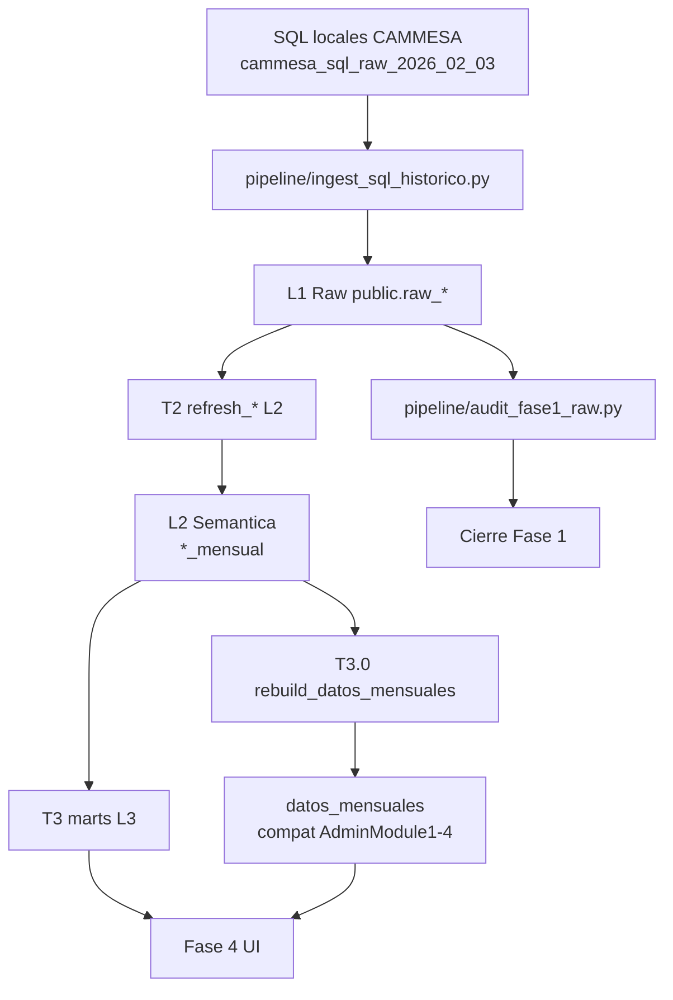

# EnergyOS CAMMESA Dataflow

## Flujo

## Capas

| Capa | Tablas | Regla |
|---|---|---|
| L1 Raw | `raw_*` | espejo posicional, no negocio |
| L2 Semantica | `*_mensual` tipadas | parser reproducible por periodo |
| L3 Marts | agregados producto | solo consumidos por UI/API |
| UI | modulos y pantallas | nunca consultar `raw_*` |

## Gates

| Gate | Comando |
|---|---|
| Fase 1 cierre | `python pipeline\audit_fase1_raw.py --fail-on-mismatch --output docs\cammesa_phase1_audit.md` |
| T2 helper smoke | query de `parse_es_number`, `parse_es_date`, `nemo_from` |
| T2 parser | `refresh_*` en 2021, 2024, 2026 |
| T3 mart | `refresh_*` + reconciliacion contra L2 |
| UI | no raw, estados loading/error/empty/restricted |

## Regla de oro

Si UI necesita un numero, debe venir de L3 o `datos_mensuales`. Si no existe, crear L2/L3; no consultar L1.
